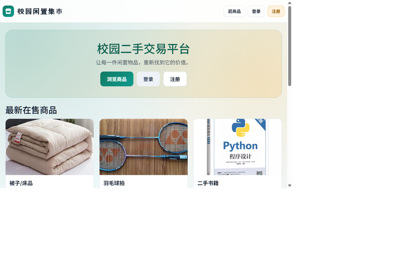
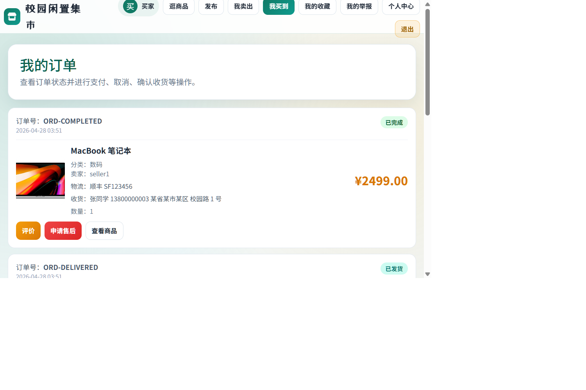
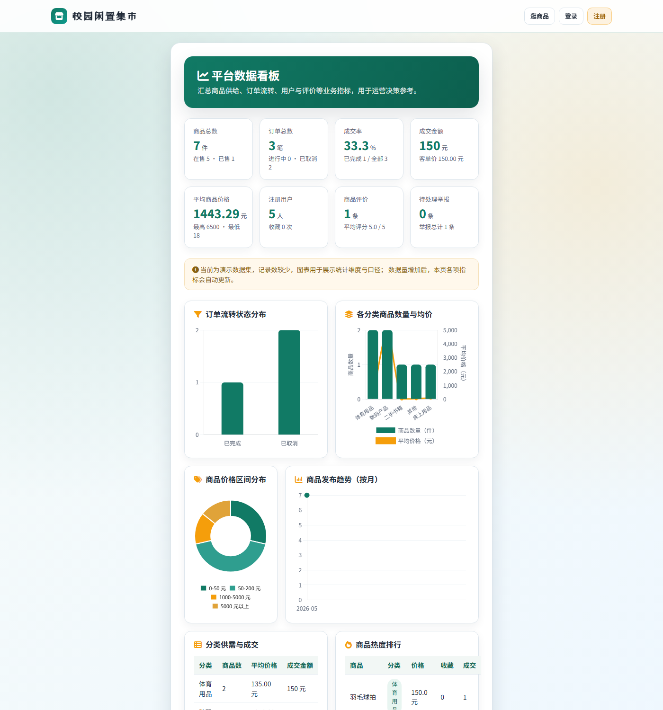
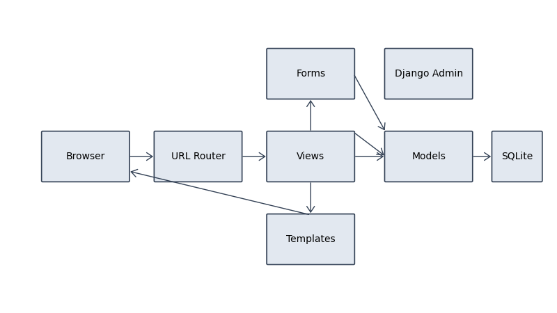
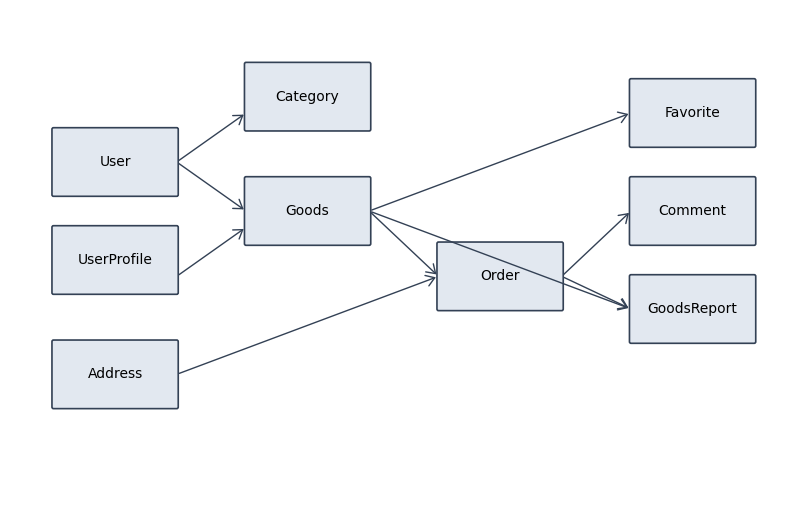
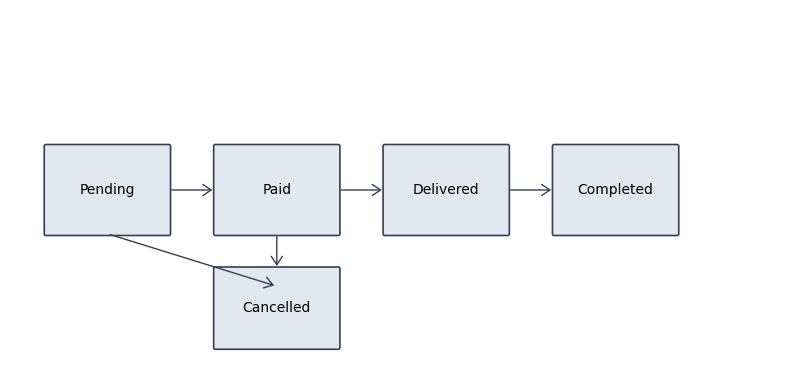
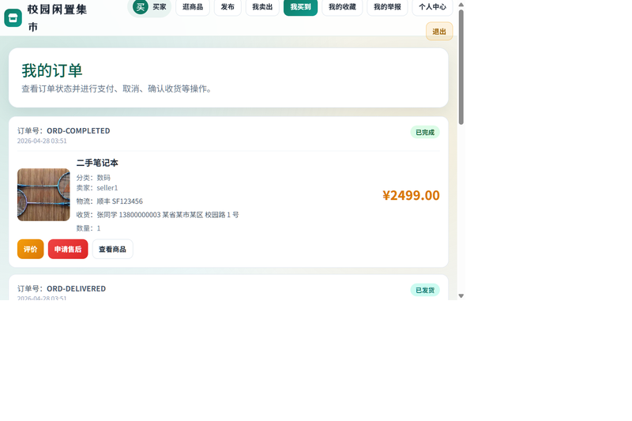

# 校园二手交易平台

> 基于 Django 的校园闲置物品交易系统，面向高校场景，支持商品发布与检索、订单全流程流转、售后处理与交易评价，并附带一套运营数据看板与业务分析工具。


南京财经大学 计算机与人工智能学院 · 大数据管理与应用 2201 · 本科毕业设计
作者：陆宇翔（2120222308）　校内导师：赵明　校外导师：周芳

---

## 项目亮点

| 亮点 | 说明 |
|---|---|
| **完整订单状态机 + 独立售后流程** | 订单覆盖待支付 → 已支付 → 已发货 → 已完成（可转已取消）；售后支持**仅退款 / 退货退款 / 换货 / 维修补发**四种类型，与订单状态解耦 |
| **并发下单的库存一致性** | 下单与状态流转使用 `select_for_update()` 数据库行锁配合 `transaction.atomic()`，避免高并发下的超卖与状态错乱 |
| **站内运营数据看板** | 8 项核心指标 + 4 类图表（含双轴组合图），统计在数据库侧通过 ORM 聚合完成，不把明细取到应用层循环 |
| **10 个业务分析 SQL 查询** | 覆盖多表关联、分组聚合、`CASE WHEN` 分箱、`HAVING` 过滤、日期维度统计，每条均附业务问题与结果解读 |
| **数据库层面的约束设计** | 评价与订单一对一（保证一单只能评价一次）、收藏联合唯一约束、默认地址在模型层自动维护 |
| **基础安全实践** | 密码经 PBKDF2-SHA256 哈希存储；全部数据库操作经 ORM 参数化，规避 SQL 注入；表单受 CSRF 中间件保护 |

---

## 目录

[快速开始](#快速开始) · [界面预览](#界面预览) · [数据统计分析](#数据统计分析) · [系统设计](#系统设计) · [关键技术实现](#关键技术实现) · [功能测试](#功能测试) · [技术栈](#技术栈) · [项目结构](#项目结构) · [已知不足](#已知不足)

---

## 快速开始

### 环境要求

- Python 3.9 及以上（已在 Python 3.12 上验证）
- pip

### 安装与运行

```bash
# 1. 创建并激活虚拟环境
python -m venv venv

# Windows
venv\Scripts\activate
# macOS / Linux
source venv/bin/activate

# 2. 安装依赖
pip install -r requirements.txt

# 3. 初始化数据库（可选，仓库已内置演示数据）
python manage.py migrate

# 4. 启动开发服务器
python manage.py runserver
```

启动后访问：

| 页面 | 地址 |
|---|---|
| 网站首页 | <http://127.0.0.1:8000/> |
| **运营数据看板** | **<http://127.0.0.1:8000/statistics/>** |
| 后台管理 | <http://127.0.0.1:8000/admin/>（需先 `python manage.py createsuperuser`） |

> **Windows 用户**：完成上述安装后，可直接双击项目根目录的 `启动.bat`
> 启动服务并自动打开浏览器，无需手动敲命令。

> 仓库内置 `db.sqlite3`，含演示数据（5 个用户、7 件商品、3 笔订单、5 个分类）。
> 想直接查看带数据的界面效果，可跳过第 3 步；想从空库开始则执行第 3 步。
>
> 数据库中的用户密码均经 PBKDF2 哈希加密，无法反推明文。可自行注册新账号，
> 体验发布商品、下单、评价等完整流程。

---

## 界面预览

### 首页



### 商品详情


### 订单列表



> 更多界面截图（商品列表、发货弹窗、个人中心、后台管理、订单状态测试）
> 见 [`docs/images/`](docs/images/)。

---

## 数据统计分析

项目在交易功能之外提供了两个数据侧能力，用于回答运营问题。

### 站内运营数据看板

访问 `/statistics/`（或点击导航栏「数据看板」）。



| 区块 | 内容 |
|---|---|
| **核心指标卡** | 商品总数与在售/已售结构、订单总数与进行中/已取消、成交率、成交金额与客单价、平均商品价格、注册用户、评价数与平均评分、待处理举报 |
| **图表区** | 订单流转状态分布（柱状）、各分类商品数量与均价（柱状 + 折线双轴）、商品价格区间分布（环形）、商品发布趋势（折线） |
| **明细表** | 分类供需与成交对比、商品热度排行（收藏数与成交数） |

统计在数据库侧完成，使用 ORM 聚合函数与 `annotate` 分组，一条 SQL 出结果：

```python
# 订单状态分布：数据库侧分组统计，不把明细取回应用层
status_rows = (Order.objects.values('order_status')
               .annotate(n=Count('id')).order_by('order_status'))
```

### 业务分析 SQL 查询集

[`analysis/queries.sql`](analysis/queries.sql) 包含 **10 个业务分析查询**，
每条都标注了【业务问题】【考察点】【结果解读】三段注释：

| # | 查询 | 涉及考点 |
|---|---|---|
| Q1 | 各分类商品供给情况 | `LEFT JOIN` + `GROUP BY` + 聚合 |
| Q2 | 商品价格区间分布 | `CASE WHEN` 分箱 + 占比计算 |
| Q3 | 订单流转状态分布 | `CASE WHEN` 状态映射 + 子查询占比 |
| Q4 | 支付状态与售后统计 | `UNION ALL` 合并多维度 |
| Q5 | 成交金额与客单价 | `WHERE` 口径过滤 + 多聚合 + `IFNULL` |
| Q6 | 各分类成交表现 | 多表 `JOIN` + 供需对比 |
| Q7 | 用户购买行为 | `GROUP BY` + `HAVING` |
| Q8 | 商品上架时间分布 | 日期函数 `strftime` 按月分组 |
| Q9 | 评价与评分分析 | 条件聚合 `SUM(CASE WHEN ...)` |
| Q10 | 商品热度排行 | 多次 `LEFT JOIN` 聚合 + 多字段排序 |

**分析脚本** `analysis/run_analysis.py` 解析上述 SQL、执行查询、生成图表并汇总为
Markdown 报告：

```bash
# 需要额外安装绘图依赖（可选，不影响网站运行）
pip install -r analysis/requirements.txt
python analysis/run_analysis.py
```

产出以下图表：

| 各分类商品数量与均价 | 商品价格区间分布 |
|---|---|
|  |  |

| 订单状态分布 | 商品价格分布 |
|---|---|
|  |  |

> **数据量说明**：仓库内为演示数据集（7 件商品、3 笔订单），因此图表侧重展示
> **统计维度与分析口径**，尚不足以支撑时间序列趋势与转化漏斗分析。
> 分析脚本不依赖具体数据量，数据积累后重新运行即可得到趋势结果。

---

## 系统设计

### 系统架构

采用 Django **MTV** 三层架构，开发阶段使用 SQLite 作为数据库。



请求处理流程：

1. 浏览器发起请求，经 **URL Router** 分发到对应的视图函数
2. 视图函数按业务需要调用 **Forms**（表单校验）、**Models**（数据读写）
3. Models 通过 Django ORM 操作 **SQLite** 数据库
4. 视图渲染 **Templates** 返回页面，或返回 **JSON** 响应（用于 AJAX 局部刷新）
5. **DjangoAdmin** 直接基于模型提供后台增删改查能力

**数据流示例（下单）**：读取商品、地址与用户信息 → 校验商品状态与库存 → 写入 Order
→ 扣减库存 → 返回订单结果。整个流程包裹在数据库事务中。

### 功能模块

系统划分为 9 个功能模块，共 11 个数据模型、约 50 个功能端点。

| 模块 | 主要功能 |
|---|---|
| **用户模块** | 注册、登录、退出；个人资料维护（昵称/手机号/学校/头像）；密码修改 |
| **商品模块** | 商品发布、编辑、下架；列表浏览；按分类与关键词检索；商品详情 |
| **收藏模块** | 收藏/取消收藏；收藏列表 |
| **订单模块** | 下单、模拟支付、卖家发货、买家确认收货、取消订单（买家与卖家两侧） |
| **售后模块** | 售后申请与处理，支持 **仅退款 / 退货退款 / 换货 / 维修补发** 四种类型 |
| **评价模块** | 交易完成后评价（1–5 星 + 文字）；评价编辑；商品评价列表；我的评价 |
| **地址模块** | 多地址管理、设为默认地址、下单时选择收货地址 |
| **举报模块** | 商品举报（质量问题/虚假信息/价格争议/违规内容/其他）；举报记录查询 |
| **数据统计模块** | 运营数据看板：核心指标、订单流转分布、分类供需对比、价格区间、发布趋势、商品热度排行 |
| **后台管理** | 基于 DjangoAdmin 的商品、订单、用户、评价、举报数据维护 |

### 数据库设计

共 11 个模型，核心实体关系如下：



| 模型 | 说明 |
|---|---|
| `UserProfile` | 用户扩展信息（与 Django 自带 User 一对一） |
| `Category` | 商品分类 |
| `Goods` | 二手商品（含状态、库存、售出标记） |
| `Order` | 订单（含订单号、状态机、支付状态、物流信息、售后字段） |
| `Address` | 收货地址（支持多地址与默认地址） |
| `Comment` | 商品评价（与订单一对一，保证一单只能评价一次） |
| `Favorite` | 收藏（`unique_together(user, goods)` 防止重复收藏） |
| `GoodsReport` | 商品举报 |

**设计要点**

- `Comment.order` 使用 `OneToOneField`，从数据库层面保证一个订单只能评价一次
- `Favorite` 使用联合唯一约束，避免重复收藏
- `Address.is_default` 在 `save()` 中自动维护「同一用户仅一个默认地址」
- 订单同时保留 `status`（简化状态，兼容旧逻辑）与 `order_status`（完整流转状态）两个字段

### 订单状态流转



| 状态 | 说明 | 可执行操作 |
|---|---|---|
| 待支付 | 下单后的初始状态 | 买家支付 / 买家取消 |
| 已支付 | 支付完成 | 卖家发货 / 买家取消 |
| 已发货 | 卖家已填写物流信息 | 买家确认收货 |
| 已完成 | 交易结束 | 买家评价 / 买家申请售后 |
| 已取消 | 订单终止 | — |

**售后流程**（独立于订单状态，仅在已支付且已发货/已完成的订单上发起）：

```
无售后 → 售后申请中 → 卖家已同意 / 卖家已拒绝 → 售后已完成
                            ↑______________|
                       （被拒绝后买家可重新提交）
```

---

## 关键技术实现

### 1. 并发下单的库存一致性

下单时若不做处理，两个买家同时购买最后一件商品会出现超卖。实现中对商品行加了数据库行锁：

```python
with transaction.atomic():
    goods = get_object_or_404(Goods.objects.select_for_update(), id=goods_id)
    if goods.stock <= 0:
        return JsonResponse({'ok': False, 'msg': '商品已售罄'})
    goods.stock -= quantity
    goods.save(update_fields=['stock'])
    # ... 创建订单
```

`select_for_update()` 在事务内锁定该行，第二个并发请求会等待锁释放后再读取，从而读到已扣减的库存。

### 2. 订单状态操作的原子性

所有状态流转（支付、发货、确认收货、取消、售后）都包裹在 `transaction.atomic()` 中，
并通过行锁重新读取订单，避免重复提交导致的状态错乱：

```python
with transaction.atomic():
    locked_order = Order.objects.select_for_update().get(id=order.id)
    # 校验状态 → 修改 → 保存
```

### 3. 业务规则的前置校验

状态是否允许操作，由模型方法统一判断，避免视图层散落重复逻辑：

- `Order.can_cancel()` — 仅待支付/已支付可取消
- `Order.can_apply_aftersale()` — 仅已支付且已发货/已完成可申请售后，且卖家拒绝后允许重新提交
- `Comment.clean()` — 校验评价人、订单与商品一致性、订单已支付且已完成

### 4. 查询性能优化

列表类查询使用 `select_related` 预取关联对象，避免 N+1 查询：

```python
Goods.objects.filter(status=1, stock__gt=0).select_related('category', 'seller')
```

### 5. 安全处理

- 用户密码通过 Django 内置机制以 **PBKDF2-SHA256** 哈希存储，不保存明文
- 所有数据库操作经 ORM 完成，不拼接 SQL 字符串，规避 SQL 注入
- 表单提交受 Django **CSRF 中间件**保护
- 涉及用户数据的视图统一使用 `@login_required` 装饰器
- 敏感操作（修改密码等）在会话中重新校验身份

---

## 功能测试

采用手工功能测试，按模块逐条验证业务流程。下图为订单状态流转的测试记录：



| 测试项 | 验证内容 |
|---|---|
| 用户流程 | 注册（含手机号唯一性校验）、登录、退出、修改资料与密码 |
| 商品流程 | 发布、编辑、下架、按分类与关键词检索、商品详情展示 |
| 订单流程 | 下单、支付、发货、确认收货、买家/卖家取消 |
| 库存一致性 | 库存为 0 时不可下单；下单后库存正确扣减；售罄后商品自动转为已售出 |
| 售后流程 | 申请、卖家同意/拒绝、拒绝后重新申请、售后完成 |
| 评价流程 | 未完成订单不可评价；重复评价被拦截；评价列表与编辑 |
| 权限控制 | 未登录跳转登录页；非本人不可编辑他人商品与地址 |

---

## 技术栈

| 层次 | 技术 |
|---|---|
| 后端 | Python 3.12 · Django 4.2.27（MTV 架构、ORM、DjangoAdmin） |
| 数据库 | SQLite（开发阶段） |
| 前端 | HTML5 · CSS3 · JavaScript · jQuery 3.7.1 · Django Template |
| 图表 | Chart.js 4.4（站内数据看板）· Matplotlib 3.11（离线分析报告） |
| 图像处理 | Pillow 11.3（用户头像与商品图片上传） |
| 交互方式 | 传统表单提交 + AJAX 局部刷新（Fragment 模板） |
| 数据分析 | Django ORM 聚合统计 · 业务 SQL 查询集 |

---

## 项目结构

```
campus_second_hand/
├── campus_second_hand/          # 项目配置
│   ├── settings.py              # 全局配置
│   ├── urls.py                  # 根路由
│   ├── wsgi.py / asgi.py
│   └── static/js/               # 前端静态资源（jQuery）
├── core/                        # 核心应用
│   ├── models.py                # 11 个数据模型
│   ├── views.py                 # 视图逻辑
│   ├── forms.py                 # 表单校验
│   ├── urls.py                  # 应用路由
│   ├── admin.py                 # 后台注册与配置
│   ├── migrations/              # 数据库迁移（19 个）
│   └── templates/core/          # 21 个页面模板（含数据看板 statistics.html）
├── analysis/                    # 数据分析工具
│   ├── queries.sql              # 10 个业务分析 SQL 查询
│   ├── run_analysis.py          # 分析脚本（生成图表与报告）
│   ├── requirements.txt         # 分析脚本的额外依赖（可选）
│   └── 数据分析报告.md            # 自动生成的分析报告
├── docs/images/                 # 架构图、ER 图、界面截图
├── docs/images/analysis/        # 分析图表与数据看板截图
├── media/                       # 用户上传文件（头像、商品图）
├── db.sqlite3                   # 演示数据库
├── manage.py
├── requirements.txt             # 项目依赖
└── 启动.bat                      # Windows 一键启动脚本（双击运行）
```

---

## 已知不足

如实记录，作为后续改进方向：

1. **未做生产环境部署** —— 当前为开发配置（`DEBUG = True`、`SECRET_KEY` 硬编码在 `settings.py`）。若部署需改用环境变量注入密钥、关闭调试模式、配置 `ALLOWED_HOSTS` 与静态文件服务。
2. **数据库为 SQLite** —— 适合课程项目与本地演示，高并发场景应迁移至 MySQL 或 PostgreSQL。
3. **支付为模拟实现** —— 未接入真实支付网关。
4. **未做单元测试覆盖** —— 目前以手工功能测试为主，`tests.py` 尚未编写用例。
5. **`Order` 保留了新旧两套状态字段** —— `status` 是为兼容早期逻辑保留的简化状态，后续可考虑统一到 `order_status` 上。
6. **前端未做组件化** —— 页面以 Django 模板渲染为主，部分交互使用 jQuery 直接操作 DOM，未引入前端框架。
7. **演示数据量较小** —— 数据看板与分析报告侧重展示统计维度与口径，尚不足以支撑时间序列趋势与转化漏斗分析。

---

## License

本项目基于 [MIT License](LICENSE) 开源，仅用于学习与技术交流。
