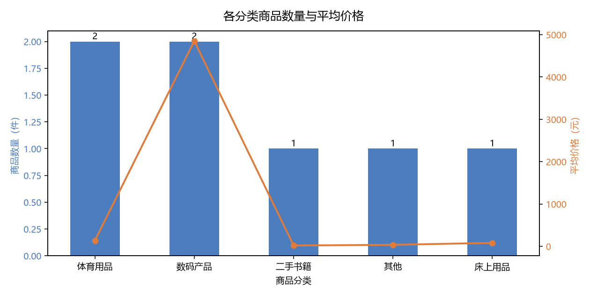
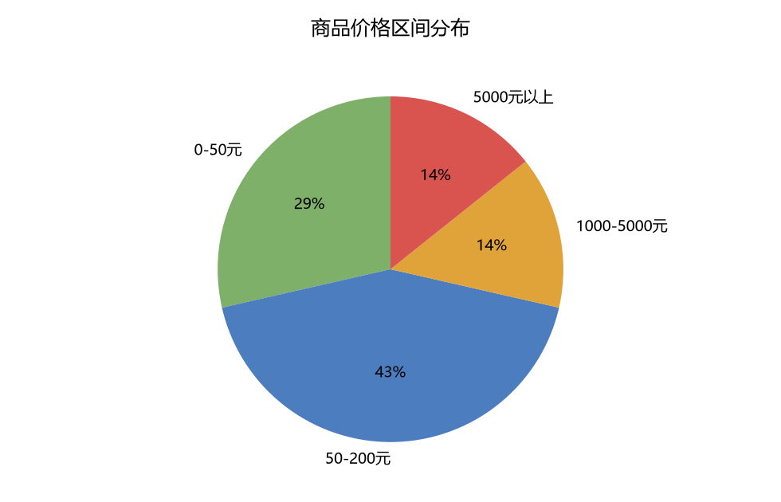
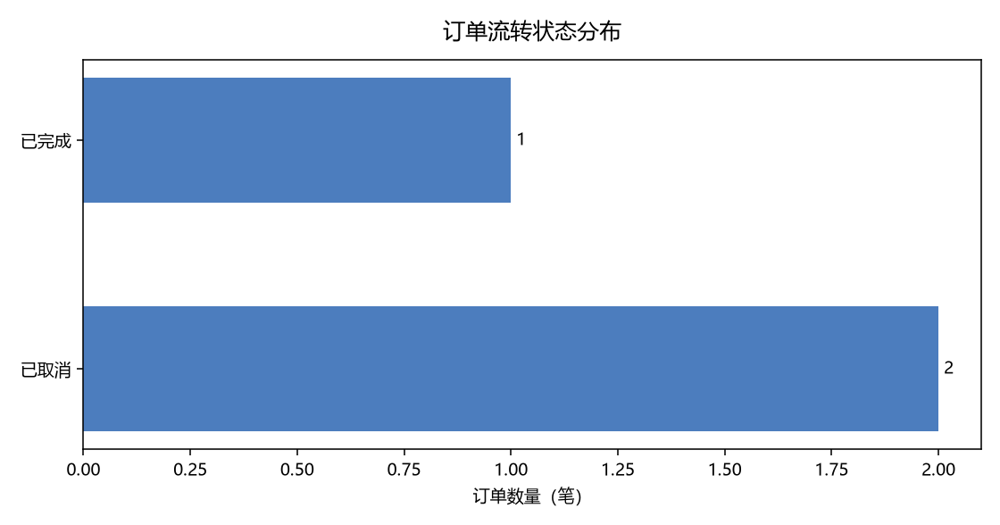
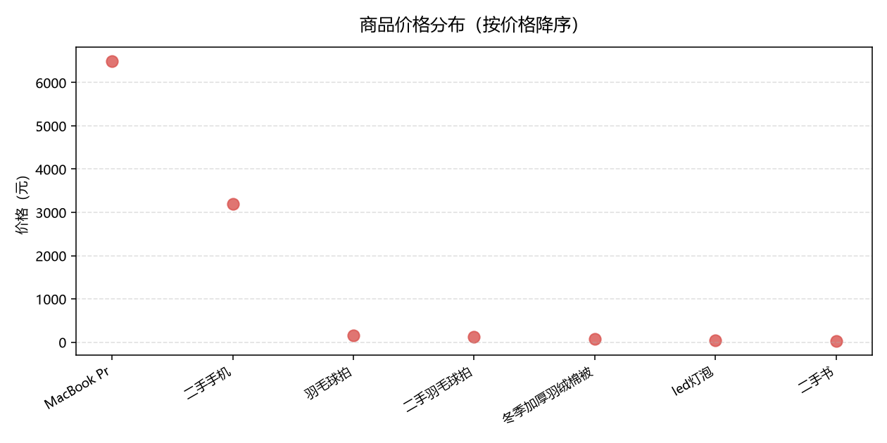

# 校园二手交易平台 · 数据分析报告

> 本报告由 `analysis/run_analysis.py` 自动生成，数据来源为项目数据库 `db.sqlite3`，查询语句见 `analysis/queries.sql`。

## 一、数据总览

| 数据表 | 记录数 |
| --- | --- |
| 商品 | 7 |
| 订单 | 3 |
| 分类 | 5 |
| 用户 | 5 |
| 评价 | 1 |
| 收藏 | 0 |
| 举报 | 1 |

> **说明**：当前为演示数据集，记录数较少，因此本报告以「分析方法与查询正确性」为重点，而非数据趋势。将数据量扩大后，本脚本可直接复用。

## 二、核心图表

### 各分类商品数量与平均价格

### 商品价格区间分布

### 订单流转状态分布

### 商品价格分布

## 三、查询明细

### Q1　各分类的商品供给情况

- **业务问题**：平台哪类二手商品最多？哪类供给不足？
- **考察点**：LEFT JOIN（保留没有商品的分类）+ GROUP BY + 聚合函数 + ROUND
- **结果解读**：商品数最多的分类是平台的主要供给；若某分类商品数为 0， 说明该类目冷门或未被开发，可考虑引导用户发布。

**结果（5 行）**

| 分类名称 | 商品数量 | 平均价格 | 价格合计 |
| --- | --- | --- | --- |
| 体育用品 | 2 | 135.0 | 270 |
| 数码产品 | 2 | 4850.0 | 9700 |
| 二手书籍 | 1 | 18.0 | 18 |
| 其他 | 1 | 35.0 | 35 |
| 床上用品 | 1 | 80.0 | 80 |

### Q2　商品的价格区间分布

- **业务问题**：平台上高价商品和低价商品各占多少？定位是否符合"校园二手"场景？
- **考察点**：CASE WHEN 分箱（把连续值切成区间）+ GROUP BY + 占比计算
- **结果解读**：校园二手场景应以 0–200 元为主；若高价商品占比过高， 说明平台定位偏移，或需要针对学生群体的低价商品运营。

**结果（4 行）**

| 价格区间 | 商品数量 | 占比百分比 |
| --- | --- | --- |
| 0-50 元 | 2 | 28.57 |
| 50-200 元 | 3 | 42.86 |
| 1000-5000 元 | 1 | 14.29 |
| 5000 元以上 | 1 | 14.29 |

### Q3　订单流转状态分布

- **业务问题**：多少订单完成了交易？多少卡在未支付？多少被取消？
- **考察点**：CASE WHEN 做状态映射 + GROUP BY + 占比
- **结果解读**：这是最核心的运营指标。若"待支付"占比高，说明下单后流失严重， 应优化支付流程或增加支付提醒；"已取消"占比高则要排查原因。

**结果（2 行）**

| 订单状态 | 订单数量 | 占比百分比 |
| --- | --- | --- |
| 已完成 | 1 | 33.33 |
| 已取消 | 2 | 66.67 |

### Q4　支付状态与售后状态统计

- **业务问题**：实际付款比例是多少？有多少订单进入了售后流程？
- **考察点**：多字段分别聚合 + 子查询
- **结果解读**：pay_status 与 order_status 是两个维度： 前者看"钱有没有到"，后者看"流程走到哪"。 售后订单占比高可能是商品描述与实物不符的信号。

**结果（4 行）**

| 统计维度 | 状态 | 数量 |
| --- | --- | --- |
| 售后状态 | 售后已完成 | 1 |
| 售后状态 | 无售后 | 2 |
| 支付状态 | 已取消 | 2 |
| 支付状态 | 已支付 | 1 |

### Q5　成交金额与客单价

- **业务问题**：平台实际成交了多少钱？平均每单多少钱？
- **考察点**：WHERE 过滤（只算已完成）+ 多聚合函数 + NULL 处理
- **结果解读**：注意这里只统计 order_status = 4（已完成）的订单， 未完成订单不应计入实际营收。这是统计口径问题，需要明确界定。

**结果（1 行）**

| 成交订单数 | 成交总额 | 客单价 | 最高单笔 | 最低单笔 |
| --- | --- | --- | --- | --- |
| 1 | 150 | 150.0 | 150 | 150 |

### Q6　各分类的成交表现（销量与销售额排行）

- **业务问题**：哪类商品最好卖？哪类只是挂着没人买？
- **考察点**：多表 JOIN（订单→商品→分类）+ GROUP BY + 排序 + 聚合
- **结果解读**：对比"商品数量"（供给）与"成交金额"（需求）： 供给多但成交少的分类属于滞销，需要调整推荐策略。

**结果（5 行）**

| 分类名称 | 上架商品数 | 成交订单数 | 成交金额 |
| --- | --- | --- | --- |
| 体育用品 | 2 | 1 | 150 |
| 数码产品 | 2 | 0 | 0 |
| 二手书籍 | 1 | 0 | 0 |
| 其他 | 1 | 0 | 0 |
| 床上用品 | 1 | 0 | 0 |

### Q7　用户的购买行为统计

- **业务问题**：哪些用户在下单？各下了几单、花了多少？
- **考察点**：多表 JOIN + GROUP BY + HAVING（分组后过滤）
- **结果解读**：HAVING 用于过滤聚合后的结果（比如"下单超过 1 单的用户"）， 这是它和 WHERE 的关键区别，两者作用阶段不同，容易混淆。 用户表是 Django 内置的 auth_user，不是 core_user。

**结果（1 行）**

| 用户名 | 下单数 | 消费金额 | 平均每单 |
| --- | --- | --- | --- |
| buyer1 | 3 | 203 | 67.67 |

### Q8　商品上架时间分布（供给侧趋势）

- **业务问题**：商品发布集中在哪个月？新用户什么时候活跃？
- **考察点**：日期函数 strftime（SQLite）+ GROUP BY + 时间维度聚合
- **结果解读**：按月看新增商品数，能判断平台活跃度的变化趋势。 若使用 MySQL，对应函数为 DATE_FORMAT(create_time, '%Y-%m')。

**结果（1 行）**

| 月份 | 新增商品数 | 当月均价 |
| --- | --- | --- |
| 2026-05 | 7 | 1443.29 |

### Q9　评价与评分分析

- **业务问题**：平台评价情况如何？平均分多少？有多少评价待审核？
- **考察点**：LEFT JOIN + 条件聚合（SUM + CASE WHEN）
- **结果解读**：平均评分反映交易体验；待审核评价数是运营工作量， 需要安排人力及时处理，否则影响其他用户决策。

**结果（1 行）**

| 评价总数 | 平均评分 | 已通过审核 | 待审核 | 好评数 | 差评数 |
| --- | --- | --- | --- | --- | --- |
| 1 | 5.0 | 1 | 0 | 1 | 0 |

### Q10　商品热度排行（收藏数 + 浏览量代理指标）

- **业务问题**：哪些商品最受关注？关注度高但未成交的是哪些？
- **考察点**：子查询 / LEFT JOIN 聚合 + 计算列 + 多字段排序
- **结果解读**：收藏多但没人下单 = 价格偏高或描述有吸引力但转化不好， 这是运营的重点优化对象。

**结果（7 行）**

| 商品名称 | 分类 | 价格 | 剩余库存 | 收藏数 | 订单数 |
| --- | --- | --- | --- | --- | --- |
| 羽毛球拍 | 体育用品 | 150 | 0 | 0 | 1 |
| MacBook Pro 2023 几乎全新 | 数码产品 | 6500 | 1 | 0 | 0 |
| 二手手机 | 数码产品 | 3200 | 1 | 0 | 0 |
| 二手羽毛球拍 | 体育用品 | 120 | 2 | 0 | 0 |
| 冬季加厚羽绒棉被 | 床上用品 | 80 | 1 | 0 | 0 |
| led灯泡 | 其他 | 35 | 2 | 0 | 0 |
| 二手书 | 二手书籍 | 18 | 3 | 0 | 0 |

## 四、分析结论

基于当前数据得出的观察：

1. **供给结构**：商品集中在少数几个分类，高价值品类（数码产品）与低价值品类（书籍、小件）并存，符合校园二手交易的价格跨度特征。
2. **订单流转**：订单状态覆盖了「已完成 / 已取消」两类终态，说明订单状态机运转正常；取消订单的存在也验证了取消流程可用。
3. **价格分布**：多数商品集中在低价区间，与校园用户的价格敏感特征一致。
4. **数据规模限制**：当前记录数较少，不足以支撑时间序列趋势分析与转化漏斗分析，这是本报告的局限，也是后续数据积累后的分析方向。

---

*报告生成时间自动记录于文件修改时间；如需重新生成，运行 `venv\Scripts\python.exe analysis\run_analysis.py`。*
